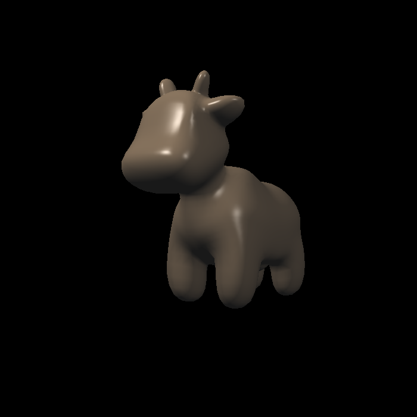
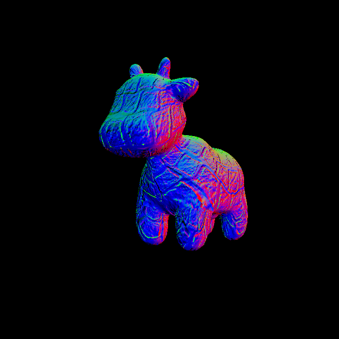
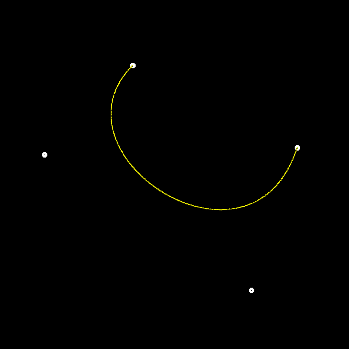
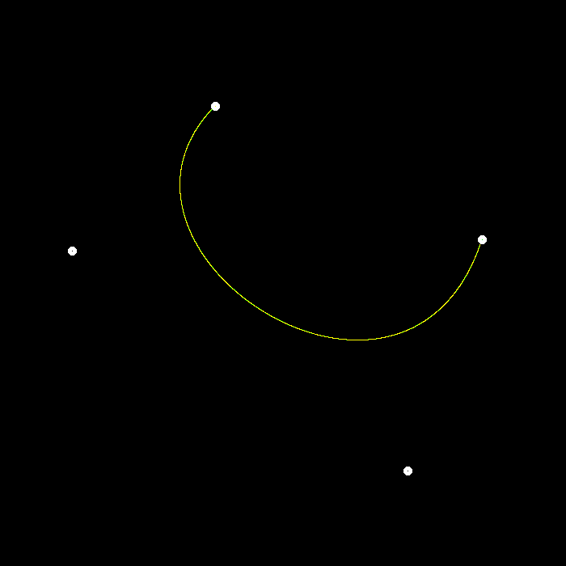
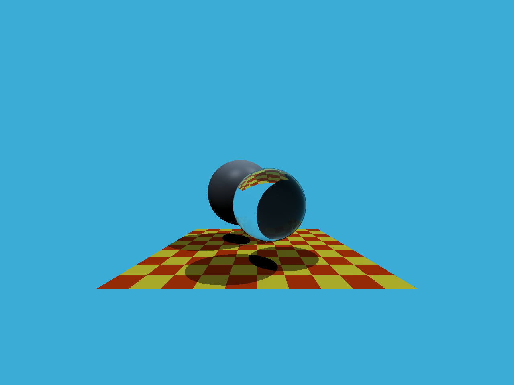
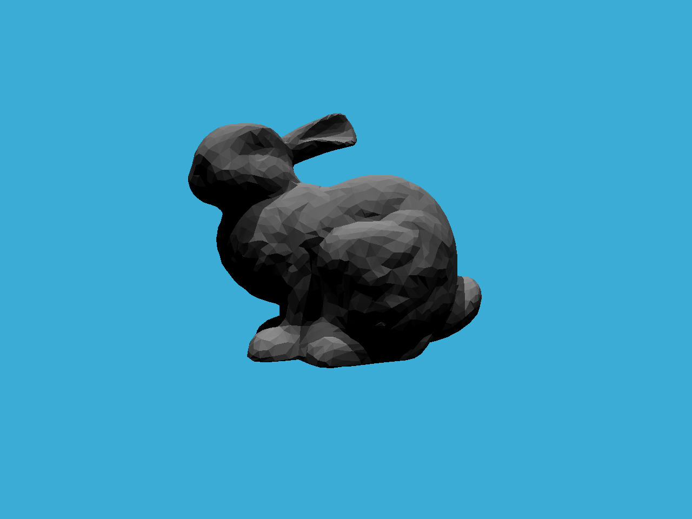
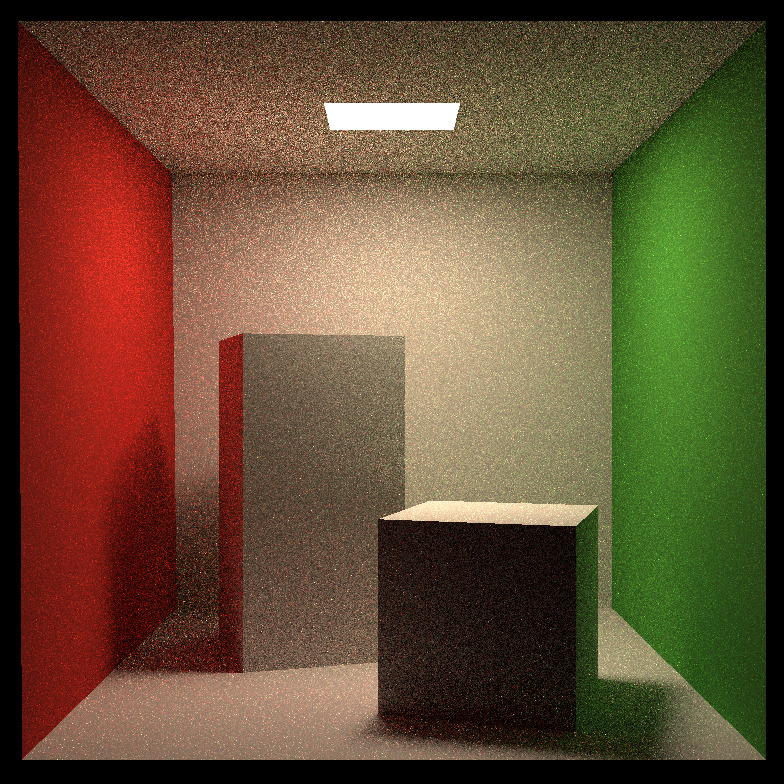

# GAMES101 Computer Graphics Assignments

## Course Note 

[(Notion Link)](https://www.notion.so/mikevon/31aba9c649ff4d44b20ce1f6cf31d17c?v=68b1b12d4cdd4f1b9375c73a17811f94)

## Homework 1 : Creating Triangles

## Homework 2 : Triangles and Z-buffering

## Homework 3 : Pipeline and Shading

Phong        | Normal        | Texture       | bump          | Displacement  |
------------ | ------------- | ------------- | ------------- | ------------- |
 |  | | | |

## Homework 4 : Bezier Curve

With Anti-Aliasing        | Without Anti-Aliasing      |
------------ | ------------- |
 | 

## Homework 5 : Whitted-Style RayTracing

## Homework 6 : RayTracing 2

## Homework 7 : Path Tracing

SPP (Sample Per Pixel) = 8       | SPP (Sample Per Pixel) = 16      |
------------ | ------------- |
 | 
